# Workflow Diagrams

This document turns the implemented Trust Ledger workflows into visual diagrams.

It is intentionally based on the real rebuild, not on the original concept alone.

That means these diagrams reflect:

- the current backend routes,
- the current service boundaries,
- the current frontend workspaces and lanes,
- the current neutral-reviewer model instead of the old public `judge` role.

Use this together with:

- `docs/WORKFLOW_MAP.md` for the written flow map
- `docs/CODEBASE_REFERENCE.md` for the code-level reference
- `docs/WORKSPACE_GUIDE.md` for the operator/user guide

## Diagram 1: Workspace And Role View

This diagram shows how the main roles enter the product and which frontend workspace they primarily use.

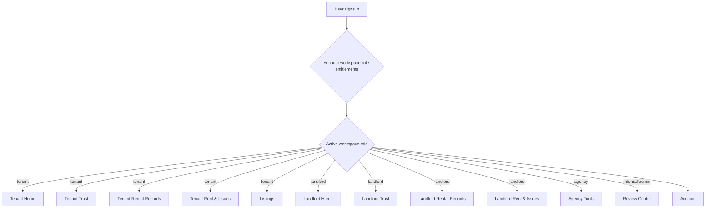

### What this reflects

- Account role visibility is explicit: tenant, landlord, agency, and internal/admin roles come from `User.workspace_roles`.
- Login is email/password only; the active role is resolved after authentication and can be changed from the sidebar.
- Personal users only see tenant or landlord modes when those entitlements are assigned.
- Agency mode can be assigned independently, but backend agency work still requires active agency organization membership.
- Internal/admin mode is separate from agency access and is synced with backend platform-admin protection.
- A user can still have multiple legitimate workspace roles, but the active role controls which workspace is visible at one time.

## Diagram 2: Property Setup To Tenancy Activation

This is the real onboarding chain for the landlord/tenant/property relationship.

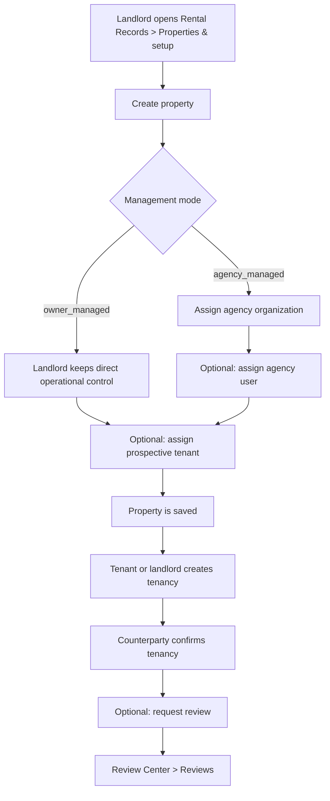

### Frontend lanes

- `Rental Records > Properties & setup`
- `Rental Records > Tenancy records`
- `Review Center > Reviews`

UX clarity note: tenancy cards now show the signed-in user's role and the relevant tenant/landlord counterparty instead of a generic `Parties` label.

### Backend surface

- properties routes
- tenancies routes
- internal review queue routes

## Diagram 3: Artifact And Evidence Lifecycle

This diagram shows the evidence-backed architecture without bank APIs.

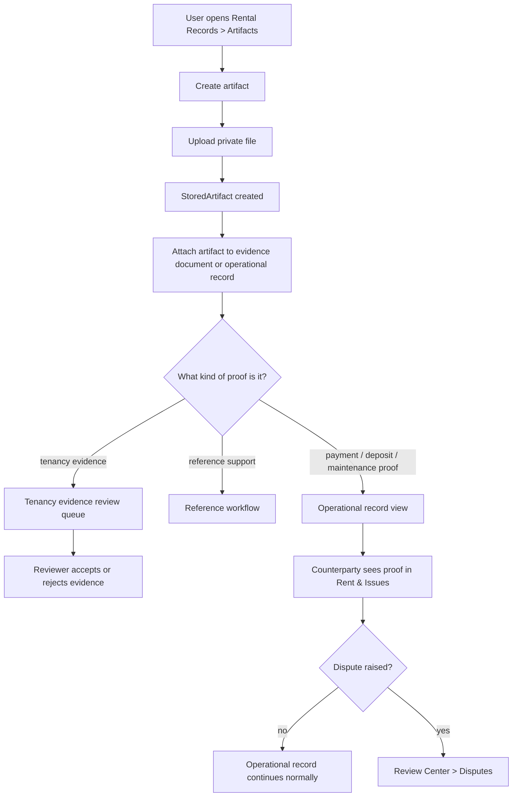

### Key architectural point

The storage layer is private and signed-access based. Files are not meant to become public URLs.

## Diagram 4: Listing, Application, And Agency Screening

This is the implemented agency pipeline from property publication to applicant handling.

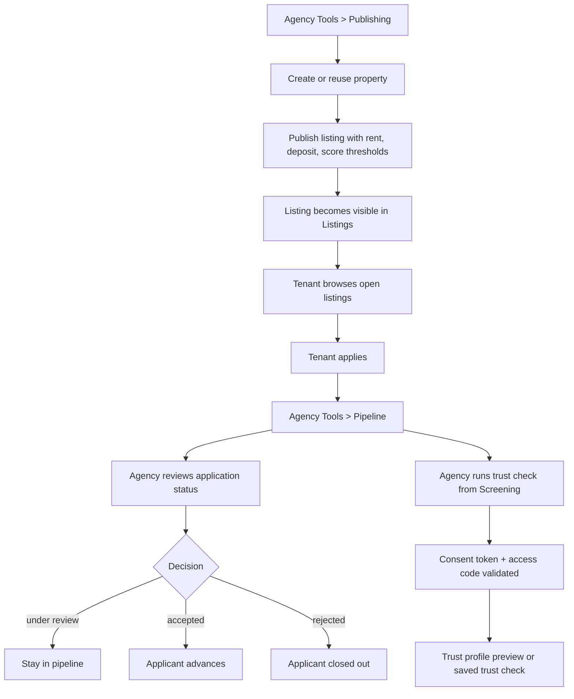

### Frontend lanes

- `Agency Tools > Publishing`
- `Agency Tools > Screening`
- `Agency Tools > Pipeline`
- `Listings`

## Diagram 5: Payment Workflow With Dispute And Appeal

This diagram reflects the actual payment lifecycle in the rebuilt app.

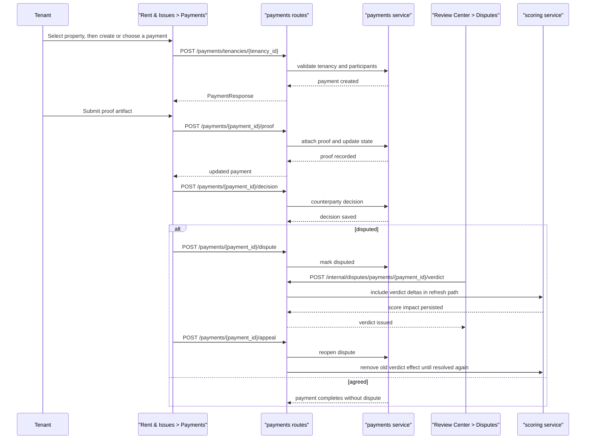

Continuity note: once a payment is disputed or appealed, the next action belongs to `Review Center > Disputes` until a reviewer issues the next verdict. The normal counterparty decision path is no longer the active handoff.

UX-reset note: the personal `Payments` lane now keeps the selected property active, separates `Create new` from `Existing records`, exposes one selected payment detail/action pane from a compact payment dropdown under existing records, and keeps proof files, old notes, prior decisions, and the read-only timeline in the selected property's separate `History` view.

### Why this matters

This is one of the clearest examples of “real workflow” in the rebuild:

- proof,
- counterparty response,
- dispute,
- reviewer verdict,
- appeal,
- score effect.

## Diagram 6: Maintenance Ticket Workflow With Dispute And Appeal

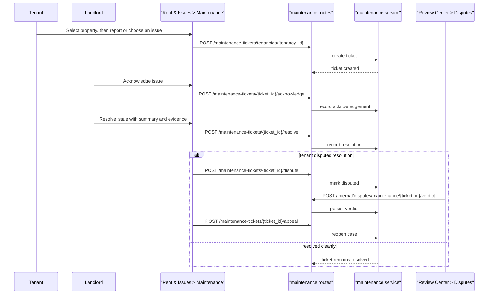

Continuity note: an appeal returns the ticket to `Review Center > Disputes`, and the earlier verdict is no longer final until a fresh verdict is issued.

UX-reset note: the personal `Maintenance` lane now keeps the selected property active, separates `Report new` from `Existing issues`, exposes one selected issue detail/action pane from a compact issue dropdown under existing issues, and keeps issue evidence, resolution notes, prior decisions, and the read-only timeline in the selected property's separate `History` view.

## Diagram 7: Deposit Settlement Workflow With Dispute And Appeal

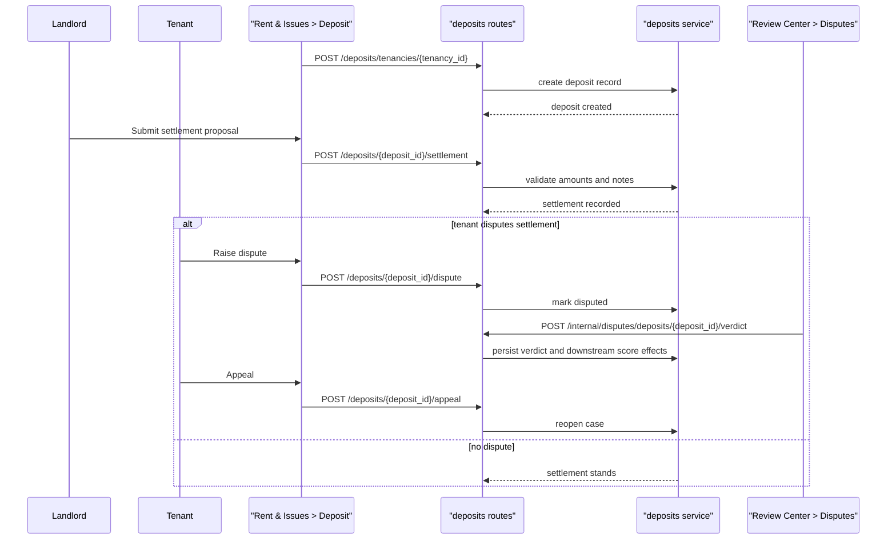

Continuity note: an appeal returns the deposit case to `Review Center > Disputes`, and the earlier verdict is no longer final until a fresh verdict is issued.

## Diagram 8: Review Center Internal Flow

This is the reason the `Review Center` was split into lanes.

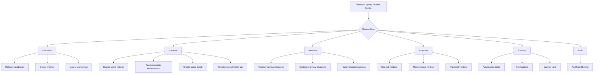

### Why the lane split matters

Before the simplification pass, this page forced operators to scan everything together.

Now the reviewer can:

- act on reviews without accidentally touching runtime controls,
- issue disputes without mixing them into audit work,
- use score/runtime controls separately from case decisions.

## Diagram 9: Trust Sharing And Agency Access

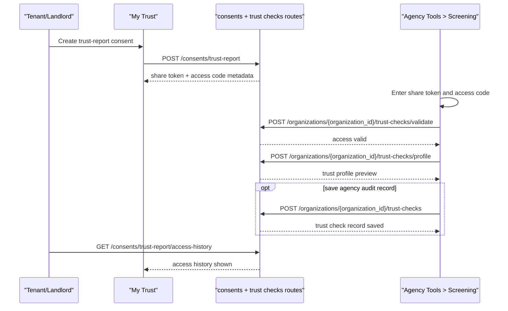

## Diagram 10: Scoring And Background Processing

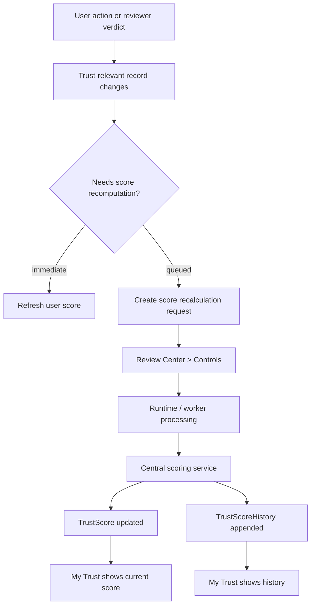

### Important implementation note

The scoring effect is not distributed randomly across route files anymore. The routes trigger workflows, but the trust-score computation is centralized in the scoring service.

Score-role note: `tenant_score` and `landlord_score` are both dimensions of the signed-in user's own trust profile. The landlord-side score is not a rating for a tenant's current landlord; it only becomes active when that same account acts as a landlord or property owner.

## Diagram 11: Demo Scenario Coverage

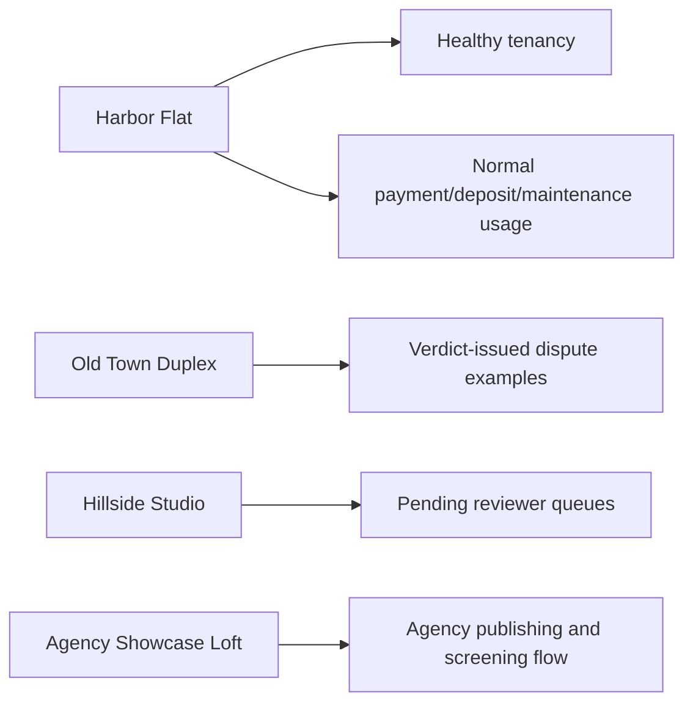

This is useful when we want to test the app without manually building data first.

## Practical Reading Order

If someone is new to the codebase, the best order is:

1. `docs/WORKSPACE_GUIDE.md`
2. `docs/WORKFLOW_DIAGRAMS.md`
3. `docs/WORKFLOW_MAP.md`
4. `docs/CODEBASE_REFERENCE.md`

That order gives:

- plain-language orientation,
- visual understanding,
- structured workflow reference,
- deep technical traceability.
